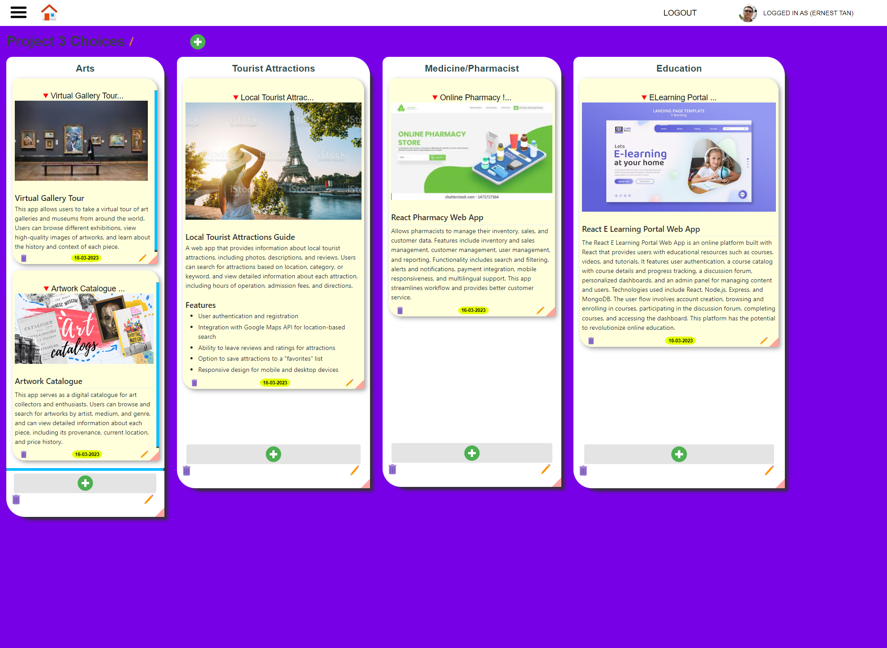
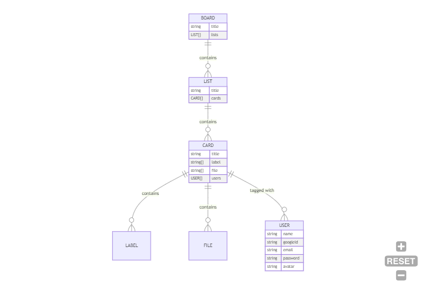

# Project Management - Task Tracking App

## Screenshot
\

## User stories
Note: For simplicity sake, all roles will be considered fullly authorized. Member = User.

1. [x] As a team member, I want to __create a new task card__ in Trello Kanban board so that I can track my progress and collaborate with my team members.

2. [x] As a team member, I want to be able to __add labels to a task card__ in Trello Kanban board so that I can easily categorize and prioritize my work.

3. [x] As a product owner, I want to __add a description and attachments__ to a task card in Trello Kanban board so that the development team has all the information they need to complete the task.

4. [x] As a project manager, I want to __assign a task to a team member__ on the Trello Kanban board so that I can ensure that everyone knows what they need to work on.

5. [x] As a project manager, I want to be able to __set due dates for tasks__ on the Trello Kanban board so that I can monitor progress and ensure that the project stays on schedule.

6. [x] As a project manager, I want to be able to __view the overall progress__ of the project on the Trello Kanban board so that I can identify areas that may require additional resources or attention.

7. [ ] As a team member, I want to be able to __move a task card to a different list__ on the Trello Kanban board so that I can keep track of its progress and prioritize my work.

8. [ ] As a team member, I want to __receive notifications__ when a task is assigned to me or when a task card is moved to a list that I am responsible for so that I can stay on top of my work.

9. [ ] As a team member, I want to be able to __add comments to a task card__ in Trello Kanban board so that I can communicate with my team members and provide updates on my progress.

10. [ ] As a team member, I want to be able to __filter tasks on the Trello Kanban board by different criteria__, such as due date or priority, so that I can easily find the tasks that I need to work on.

## Wireframe

## ERD Diagram

## RESTful Routes
### BOARD ###
- [x] NEW: GET /boards/new *
- [x] CREATE: POST /boards
- [x] READ ALL: GET /boards *
- [x] READ ONE: GET /boards/:b *
- [x] UPDATE ONE: PUT /boards/:b
- [ ] DELETE: DELETE /boards/:b

### LIST ###
- [x] NEW: GET /boards/:b/lists/new
- [x] CREATE: POST /boards/:b/lists
- [x] UPDATE ONE: PUT /board/:b/lists/:l
- [x] DELETE: DELETE /board/:b/lists/:l

### CARD ###
- [x] NEW: GET /boards/:b/lists/:l/cards/new
- [x] CREATE: POST /boards/:b/lists/:l/cards
- [x] UPDATE ONE: PUT /board/:b/lists/:l/cards/:c
- [x] DELETE: DELETE /board/:b/lists/:l/cards/:c

### MEMBERS ###
- [x] NEW: GET /users/new
- [x] CREATE: POST /users
- [ ] READ ONE: GET /users
- [ ] UPDATE ONE: PUT /users/:u
- [ ] DELETE: DELETE /users/:u

### LABEL ###
- [x] CREATE: POST /boards/:b/labels
- [x] DELETE: DELETE /board/:b/labels/:c

## To Do
### Deployment
1. Deploy to Render [x]
2. Deploy to Cyclic [x]

### Data and Validation
1. Fix the date in the card edit form [x]
2. Validation at view level - html [x]
3. Validation at model level - mongoose [/]
4. Validation at controller level - express [ ]

### Power Feature
1. Markdown element [x]
2. S3 + Multer : File upload for board files [x]

### Security
1. Google OAuth [x]

### UI
1. Resize cards and lists [x]
2. Save their positions [ ]
2. Move cards within the list (sort) [ ]
3. Move cards between 2 lists [ ]

## Soft Launch
- [x] Change the labels to simply strings, because it is not expected to have extended functionality
- [x] Explain the zero-md web component
- [x] Date conversion to be done by library as it is more robust and proven. Also need to learn to use Date library. either Day.js or Moment.js

## External Libraries and Credits
### Zero MD web component is used for displaying markdown content inside the cards.
https://www.npmjs.com/package/zero-md
 Note: the first line is being styled like a header by default and it starts from h2, h3 onwards.

