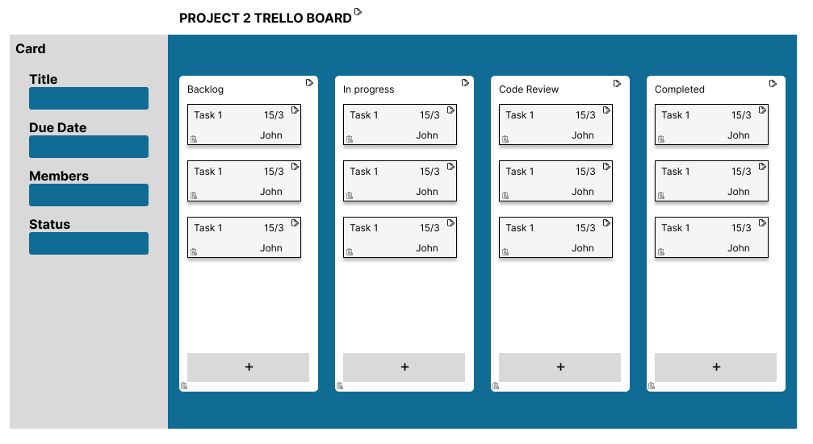

# Project Management - Task Tracking App

## User stories
Note: For simplicity sake, all roles will be considered fullly authorized.

1.As a team member, I want to __create a new task card__ in Trello Kanban board so that I can track my progress and collaborate with my team members.

2.As a team member, I want to be able to __move a task card to a different list__ on the Trello Kanban board so that I can keep track of its progress and prioritize my work.

3.As a team member, I want to __receive notifications__ when a task is assigned to me or when a task card is moved to a list that I am responsible for so that I can stay on top of my work.

4.As a team member, I want to be able to __add comments to a task card__ in Trello Kanban board so that I can communicate with my team members and provide updates on my progress.

5.As a team member, I want to be able to __filter tasks on the Trello Kanban board by different criteria__, such as due date or priority, so that I can easily find the tasks that I need to work on.

6.As a team member, I want to be able to __add labels to a task card__ in Trello Kanban board so that I can easily categorize and prioritize my work.

7.As a product owner, I want to __add a description and attachments__ to a task card in Trello Kanban board so that the development team has all the information they need to complete the task.

8.As a project manager, I want to __assign a task to a team member__ on the Trello Kanban board so that I can ensure that everyone knows what they need to work on.

9.As a project manager, I want to be able to __set due dates for tasks__ on the Trello Kanban board so that I can monitor progress and ensure that the project stays on schedule.

10.As a project manager, I want to be able to __view the overall progress__ of the project on the Trello Kanban board so that I can identify areas that may require additional resources or attention.

## Wireframe with URLs

## Data Models (User + 1 Main + 1 Related)
- Boards
- Lists
- Cards
- Members
- Labels

